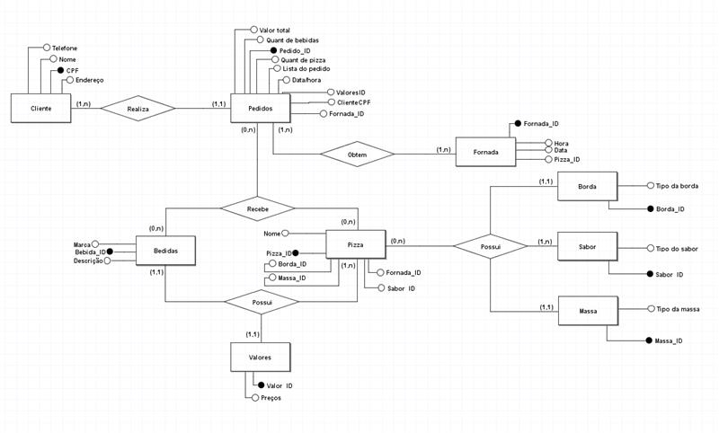

# Projeto de Banco de Dados: Sistema de Gestão de Pizzaria

Este projeto consiste no desenvolvimento de um sistema de banco de dados completo para uma pizzaria, abrangendo todas as etapas, desde o registro de clientes até a gestão de pedidos. Utilizando o MySQL Workbench, foram criados e integrados os modelos lógico, entidade-relacionamento (MER) e físico, garantindo uma representação abrangente e funcional do banco de dados.

## Descrição do Projeto

O objetivo deste projeto foi desenvolver um sistema de banco de dados capaz de gerenciar todas as operações de uma pizzaria, desde o cadastro de clientes até o registro e gestão de pedidos. Todo o processo foi realizado como parte de uma atividade prática na aula de banco de dados do curso no SENAI.

## Estrutura do Projeto

### 1. Modelo Lógico (MER)

Desenvolvi o Modelo Entidade-Relacionamento (MER) para representar as entidades e relacionamentos fundamentais do sistema, como clientes, pedidos, pizzas e bebidas. Esse modelo foi concebido para refletir de forma precisa as necessidades do sistema de gestão da pizzaria, e foi construído com base nos requisitos específicos do projeto.

### 2. Modelo Lógico

A partir do MER que desenvolvi, elaborei o Modelo Lógico do banco de dados. Esse modelo detalha as tabelas, atributos e restrições necessárias para garantir a integridade dos dados. Criei/refinei cuidadosamente cada aspecto do Modelo Lógico para garantir sua eficiência e funcionalidade.

### 3. Modelo Físico

Transformei o Modelo Lógico em um Modelo Físico detalhado, utilizando o MySQL Workbench. Esse processo envolveu a tradução dos elementos do Modelo Lógico em instruções SQL concretas para criar e configurar o banco de dados físico.

## Conteúdo do Repositório

- `Modelo_logico.txt`: Arquivo contendo o Modelo Lógico do banco de dados no formato texto.
- `Pizzaria.sql`: Arquivo SQL contendo o script de criação do banco de dados físico.
- `Pizzaria.brmodelo`: Arquivo contendo o modelo visual (Diagrama de Banco de Dados) do banco de dados.
- `Modelo_MER.png`: Imagem do Modelo Entidade-Relacionamento (MER) exportada a partir do BRModelo.
- `README.md`: Este arquivo que você está lendo agora.
  
## Tecnologias

As seguintes tecnologias foram utilizadas neste projeto:

- **BRModelo:** Utilizado para criar o Modelo Entidade-Relacionamento (MER).
- **MySQL:** Banco de Dados utilizado para criar o Modelo Físico do banco.
- **MySQL Workbench:** IDE utilizada para gerenciar o Sistema de Gerenciamento de Banco de Dados (SGBD) MySQL.
